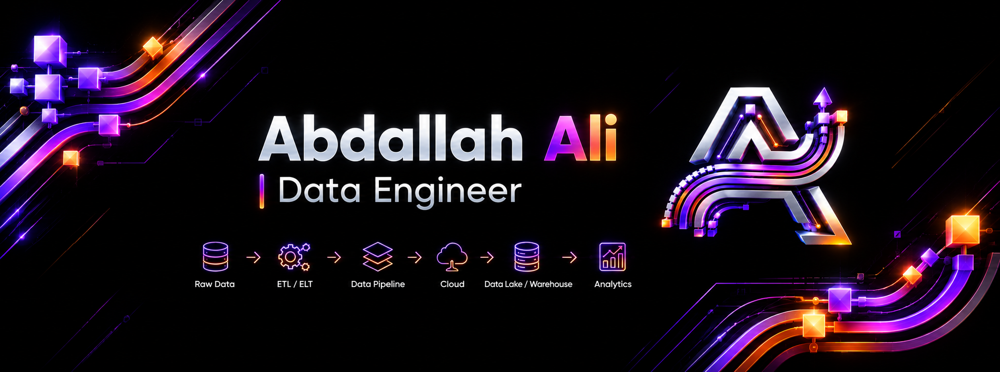

<!--
  GitHub Profile README — github.com/abdallah-farahat
  ═══════════════════════════════════════════════════
  BRAND PALETTE (pulled from your logo/banner):
    • Void black     #0A0A0F   (background / labelColor)
    • Metallic silver #C9C9D1  (secondary text/accents)
    • Neon violet    #A855F7   (primary accent — "used it in production" skills)
    • Neon orange    #F97316   (secondary accent — highlights, "learning" skills use a muted grey instead)

  SETUP:
  1. Create a repo named EXACTLY: abdallah-farahat/abdallah-farahat
  2. Inside it, make a folder called `assets/` and upload these 3 files into it,
     renamed exactly like this:
       assets/banner.png   <- your LinkedIn_Background.png
       assets/logo.png     <- your my-logo.png
  3. Put this file in the repo root as README.md
  4. (Optional bonus) See snake.yml — animated contribution snake in your colors.
     Instructions for it are at the bottom of this file.
-->

 

  

 

<!-- TODO: point the Email badge at your real address -->

 

## 🧠 About Me

I'm **Abdallah** — a final-year Business Analytics student who spends a lot more time inside T-SQL windows and Airflow DAGs than inside dashboards. My focus is squarely **data engineering**: designing warehouses that hold up under real, messy data, and building pipelines that don't quietly break when something upstream changes. I care less about running the model and more about making sure the data feeding it is actually trustworthy — deduplicated, correctly typed, and auditable.

The project I'm proudest of so far is winning **🏆 1st place in the Data Science track** of my university's Datathon — as the *only 3rd-year team* going up against senior competitors, I owned the entire data engineering layer of a prediction system, end to end, in one week. That mix of pressure and ownership is a big part of what convinced me data engineering is a career I actually want, not just a course requirement.

Right now I'm pushing into **Big Data and orchestration** — PySpark, Hadoop, Spark, and dbt — through an intensive training program, on top of DataCamp's Associate Data Engineer and SQL Associate certifications already under my belt.

 

## ⚙️ How I Work

 ➝
 ➝
 ➝
 ➝
 ➝

 

## 🛠️ Tech Stack

**Languages & Core**

**Databases**

**Cloud & Orchestration**

**DevOps & Tools**

**BI**

**🌱 Currently Learning** *(muted on purpose — not claiming mastery yet)*

 

## 🚀 Featured Projects

### 🏗️ [Olist Data Warehouse](https://github.com/abdallah-farahat/Olist_Data_Department)
A Medallion-architecture data warehouse on Azure SQL Database, built solo for a 7-person team platform. I owned the **Bronze, Silver, and Gold** layers independently, end to end — not just the modeling, but the loading, cleaning, and auditing that makes a warehouse trustworthy.

- **Bronze:** bulk-loaded 10 source tables (~375K rows) from Azure Blob Storage via T-SQL `BULK INSERT` / External Data Source, orchestrated by a single stored procedure with batch-level run auditing.
- **Silver:** window-function deduplication, type casting, and repair of corrupted Portuguese-language text encoding.
- **Gold:** a star schema (4 dimensions, 2 facts) powering a deployed analytics dashboard.

> ⚠️ *This repo currently shows as a fork on GitHub — see the note at the bottom of this README before featuring it publicly.*

### 📈 [Stock Market Data Pipeline](https://github.com/abdallah-farahat/Stock-Market-Data-Pipeline-Analysis)
A solo, production-style pipeline: Airflow-orchestrated, Docker-containerized, **31 tasks**, ingesting daily OHLCV data for 10 tickers from the Yahoo Finance API on an automated weekday schedule into PostgreSQL.

- Watermark-based incremental loading with idempotent `INSERT ... ON CONFLICT` upserts — safe to re-run without duplicating data.
- An 8-check automated data quality auditor (nulls, duplicates, price/volume integrity, outlier flags) with full run-level logging.

### 🏆 [Datathon Winner — Bank Term Deposit Prediction](https://github.com/abdallah-farahat/El_Farghaly_Bros.)
**1st place, Data Science track** — as the only 3rd-year team against senior competitors, delivered in one week on a ~41K-record banking dataset.

- Owned the data engineering layer: ingested, cleaned, and structured raw banking data from Azure SQL using SQL and pandas, feeding the team's feature engineering and modeling work.

> ⚠️ *Same fork note as above.*

### 🚗 [Car Resale Price Prediction](https://github.com/abdallah-farahat/Car_Sales_Regression_Analysis)
Data preprocessing for a 16,733-record used-car dataset (pandas, NumPy), validating the data behind a Random Forest regression model delivered via a Streamlit dashboard.

> ⚠️ *Same fork note as above.*

 

## 📊 GitHub Stats

<!--
  🐍 OPTIONAL BONUS — animated contribution snake in your exact colors.
  See snake.yml (delivered alongside this file). Once set up, uncomment this:

  
-->

 

## 🎓 Certifications & Training

- DataCamp — Associate Data Engineer
- DataCamp — SQL Associate
- Microsoft Student Ambassadors — Data Engineering Track *(selected via competitive interview)*
- Data Pill Data Engineering Program *(in progress — SQL, Data Warehousing, ETL/ELT, Big Data, dbt)*

 

📍 Badr City, Cairo, Egypt &nbsp;|&nbsp; 🎓 Business Analytics, Egyptian Russian University — Class of 2026

[LinkedIn](https://linkedin.com/in/abdallah-ali-da) · [GitHub](https://github.com/abdallah-farahat)

